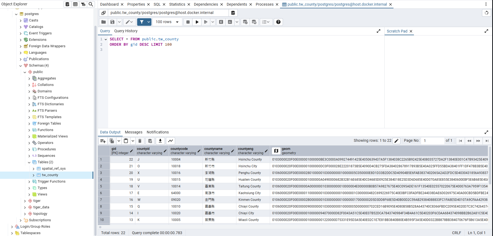

# 自動將Shape File 匯入 至 PostgreSQL

## 簡介
這是一個可以將Shapefile 自動轉成 GeoJSON並自動匯入至PostgreSQL with Postgis的功能。

## DEMO 

[Youtube](https://youtu.be/vVhk-VDiSEg)

## 使用說明

1. 在data資料夾中建立shp資料夾
    ```bash
    mkdir ./data/shp
    ```
2. 建立資料夾並將shapefile檔案放入資料夾中
    - ./data/shp/{table_name}/{shpfile}
        ```bash
        # 以 demo/tw_county.zip 為例 (資料來源 MOI)
        # 建立資料夾
        mkdir ./data/shp/tw_county

        # 將shapefile解壓縮
        unzip ./demo/tw_county.zip -d ./data/shp/tw_county/

        # 目錄架構
        ./data/
        │
        ├── shp/
        │   └── tw_county/
        │       ├── COUNTY_MOI_1130718.CPG
        │       ├── COUNTY_MOI_1130718.dbf
        │       ├── COUNTY_MOI_1130718.prj
        │       ├── COUNTY_MOI_1130718.shp
        │       └── COUNTY_MOI_1130718.shx
        └── geojson/
        ```
4. 設定PostgreSQL連線資訊
    ```bash
    cp src/.env.example ./src/.env

    # 設定.env
    DB_HOST = "IP" # 資料庫IP位置
    DB_DATABASE = "DB_NAME" # 資料庫名稱
    DB_USEE = "postgres" # 資料庫使用者
    DB_PASSWORD = "" # 資料庫密碼
    SCHEMAS = "public" # schema，預設public
    ```

5. 執行docker環境
    ```bash
    docker-compose up
    ```
    - GeoJSON結果位於 ./data/geojson/*.geojson
    - PostgreSQL
        


